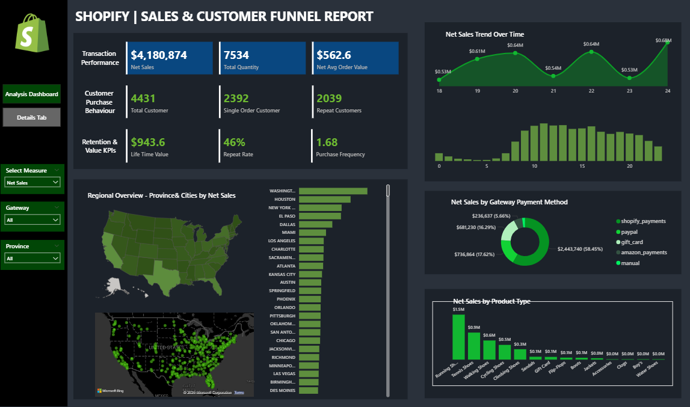
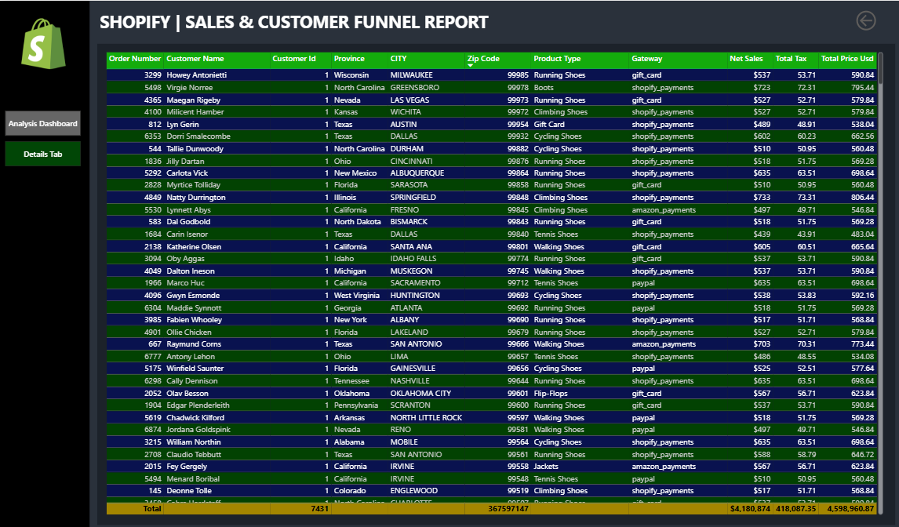

# 🛍️ E-Commerce Website Sales & Customer Insights Dashboard (Power BI)

## 📌 Overview
This Power BI dashboard provides an end-to-end view of **Shopify sales performance and customer behavior**, enabling data-driven decisions for growth, retention, and operational efficiency.  

The report includes **KPIs, trend analysis, regional performance, payment method usage, and product type insights** — all fully interactive.  

---

## 🎯 KPI Framework

### 1. Transactions Performance
Evaluate the overall health of sales operations:
- **Net Sales** → Total revenue before tax  
- **Total Quantity** → Cumulative products sold  
- **Net Avg Order Value (AOV)** → Average revenue per order (before tax)  

### 2. Customer Purchase Behavior
Understand how customers engage with the business:
- **Total Customers** → Unique buyers  
- **Single Order Customers** → Customers with only one order  
- **Repeat Customers** → Loyal customers with multiple orders  

### 3. Retention & Value KPIs
Measure long-term growth and customer lifetime value:
- **Lifetime Value (LTV)** → Total revenue per customer over time  
- **Repeat Rate** → % of customers making repeat purchases  
- **Purchase Frequency** → Average number of orders per customer  

---

## 📊 Visualizations

### 🔹 Regional Overview – Province & Cities
- **Filled Map (Province Level)** → Province performance by selected measure  
- **Bubble/Density Map (City Level)** → Sales or customer density, with tooltips showing all KPIs  
- **City Bar Chart** → Top performing cities sorted by selected KPI  

### 🔹 Sales Trend Over Time
- **Area Chart (by Day)** → Daily trend of selected measure (e.g., Net Sales, Repeat Customers)  
- **Bar/Line Chart (by Hour)** → Customer or sales activity by hour of the day (0–23 hrs)  

### 🔹 Gateway Payment Method
- Identify most/least used payment methods  
- Track regional or campaign-wise preferences  

### 🔹 Product Type
- Compare product types by revenue & order volume  
- Analyze engagement across product categories  

---
## 📈 Key Insights from the Dashboard
- **Net Sales:** '$4,180,874' revenue generated during the period  
- **Repeat Customers:** '46%' of buyers placed more than one order, showing strong retention  
- **Province-Level Sales:** 'Washington' leads in net sales, while `Second Province` shows high customer density  
- **Peak Activity:** Most orders occur between `8 AM – 4 PM`, highlighting evening shopping preference  
- **Payment Methods:** `Shopify_payments` dominates with `58.45%` share, followed by `paypal`  
- **Top Product Category:** 'Running Shoes' contributes the largest share of revenue, followed by `Tennis Shoes`  

---

## 🛠️ Tech Stack
- **Power BI Desktop** (Data Modeling + Visualization)  
- **Shopify Data Source** (sales, orders, customers)  
- **DAX Measures** for KPIs & interactivity  

---

## 🚀 How to Use
1. Clone this repo and download the `.pbix` file.  
2. Open it in **Power BI Desktop** (latest version recommended).  
3. Explore tabs:  
   - **Analysis Dashboard** → High-level KPIs & visualizations  
   - **Details Tab** → Drill-down for granular analysis  

---

## 📸 Dashboard Preview

### Main Analysis Dashboard

### Details Tab

---

## 📈 Insights Unlocked
- Which provinces and cities drive the most sales 📍  
- When customers shop the most (day/hour) ⏰  
- Customer loyalty patterns (repeat vs. one-time buyers) 💡  
- Top product categories and payment preferences 🛒  
